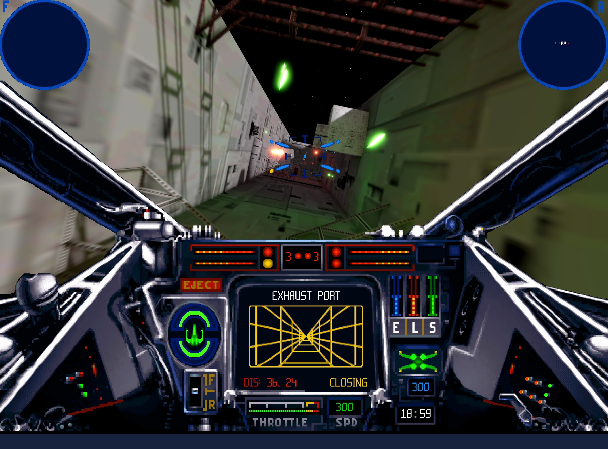

# OpenXW

OpenXW is an open-source reimplementation of *Star Wars: X-Wing* for
Windows, macOS, and Linux. It runs the original game data natively on current
systems and supports both the 1994 Collector's CD-ROM and the 1998 Windows
release.

With both editions installed, OpenXW can combine the 1994 menus, cutscenes,
and adaptive iMUSE soundtrack with the 1998 flight simulation and 3D assets.

> [!IMPORTANT]
> OpenXW does not include any content from the original game. A complete
> installation of at least one supported edition is required. Install both
> editions to use the recommended combination.
>
> *Star Wars: X-Wing Special Edition* is available from
> [GOG](https://www.gog.com/en/game/star_wars_xwing_special_edition) and
> [Steam](https://store.steampowered.com/app/354430/STAR_WARS__XWing_Special_Edition/).

## The best of both editions

The 1994 and 1998 releases each have their own presentation, flight simulation,
and soundtrack. OpenXW lets the menus and cutscenes, flight simulation, and
music be selected independently.

The recommended configuration combines:

- the 1994 menus and cutscenes
- the 1998 flight simulation and 3D assets
- the adaptive 1994 iMUSE soundtrack

This retains the 1998 flight presentation without giving up the interactive
music of the Collector's CD-ROM. Either supported edition can also be played
on its own.

The original 1993 flight graphics and missions are also available with an
extracted 1993 installation including the *B-Wing* expansion. This mode uses
the menus and cutscenes from an installed 1994 or 1998 edition.

## Adaptive music

OpenXW reimplements the adaptive iMUSE soundtrack from the 1994 Collector's
CD-ROM. The music responds to mission events and moves seamlessly between
themes during flight.

OpenXW can emulate Roland MT-32 and SC-55 Sound Canvas synthesizers. These
require compatible ROMs supplied by the user.

Built-in AdLib and OPL3 emulation are available for the classic FM-synth sound,
while FluidSynth can play the General MIDI soundtrack with a user-selected
SoundFont.

The original prerecorded 1998 music remains available when the complete 1998
experience is preferred.

## Graphics

OpenXW offers classic and modern graphics modes. Classic mode preserves the
original game's appearance, while modern mode combines the original models
and cockpit artwork with high-resolution rendering.

With the 1998 flight graphics, modern enhancements include:

- shadows, ambient occlusion, bloom, and motion blur
- anisotropic texture filtering
- 2x, 4x, or 8x MSAA
- AMD FidelityFX FSR anti-aliasing and upscaling
- HDR output
- optional smoothing of dithered cockpit artwork

The DOS flight graphics can also be rendered at higher resolutions with MSAA,
preserving their original untextured models.

Press `TAB` during flight to switch between classic and modern graphics.

## Smoother flight and modern controls

Unlocked flight timing provides smoother motion and more responsive input on
modern displays. Native timing remains available in settings when the original
flight timing is preferred.

Flight can be played with a mouse and keyboard, gamepad, or joystick. Mouse
flight offers both classic controls and a virtual stick, with adjustable
sensitivity and Y-axis inversion. Modern gamepads and joysticks are supported,
with configurable axes, deadzones, and button bindings.

## Getting started

1. Download the latest package for your platform from
   [GitHub Releases](https://github.com/elyosh/OpenXW/releases/latest).
2. Extract or install the package and launch OpenXW.
3. Select the complete 1994 and/or 1998 installation folders when prompted.
   For 1998, select the main installation folder containing `X-Wing Data`,
   `IVFiles`, and `MUSIC`.
4. If both editions are available, select the recommended configuration to
   combine the 1994 presentation and music with the 1998 flight experience.

OpenXW validates the selected installations and remembers them for future
launches.

Press `ESC` to open **OpenXW Settings**. The **Mouse** tab lets you choose
between classic and virtual-stick mouse flight controls.

Useful shortcuts:

| Key | Action |
|---|---|
| `ESC` | Open OpenXW Settings |
| `TAB` | Switch between classic and modern graphics during flight |
| `Ctrl`+`Alt`+`M` | Release or recapture the mouse during flight |

## Supported platforms

| Platform | Target | Graphics backend |
|---|---|---|
| Windows | x86-64 | Direct3D 12 or Vulkan |
| macOS | macOS 13 or later; arm64 or x86-64 | Metal |
| Linux | x86-64; glibc 2.35 or later | Vulkan |

## Current state

OpenXW remains under active development. Bugs and differences from the
original releases are still possible.

## OpenTIE, OpenXvT, and OpenXWA

Fans of Totally Games' space simulators may also be interested in
[OpenTIE](https://github.com/elyosh/OpenTIE), an open-source reimplementation
of *Star Wars: TIE Fighter*,
[OpenXvT](https://github.com/elyosh/OpenXvT), an open-source reimplementation
of *Star Wars: X-Wing vs. TIE Fighter* with *Balance of Power*, and
[OpenXWA](https://github.com/elyosh/OpenXWA), an open-source reimplementation
of *Star Wars: X-Wing Alliance*. All run on Windows, macOS, and Linux.

## Community

Join the [TotallyOpen Discord server](https://discord.gg/WBvYzczWfG) to discuss
OpenXW, OpenTIE, OpenXvT, OpenXWA, development, and the Totally Games flight
simulators.

## System requirements

- a 64-bit system with a modern GPU
- a complete installation of the 1994 Collector's CD-ROM or the 1998 Windows
  release
- a mouse and keyboard, gamepad, or joystick for flight

Release packages include the required runtime libraries. Keep the executable,
libraries, resources, and shader directories together when moving an
installation. Linux also requires the system GLib and GThread libraries.

## Building from source

The build requires CMake 3.20 or later, a C/C++ toolchain, SDL3 3.4, zstd,
FFmpeg, pkg-config, and SDL_shadercross. Release packages also include
FluidSynth and SpeexDSP for MIDI playback. Release packaging pins its
dependencies and provides the reference for reproducible builds.

Platform-specific instructions for Windows, macOS, and Linux are available in
the [packaging guide](packaging/README.md).
